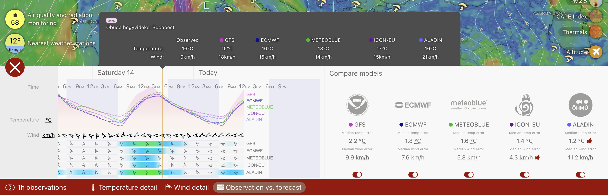

# Weather Station Project Overview

## What Problem This Solves

This project is especially useful for paragliding pilots and others whose decisions depend heavily on local wind and weather conditions.

One of the biggest practical problems is not just seeing today's forecast, but understanding how well that forecast matches the actual conditions from the last few days. Without that context, it is hard to know whether today's forecast should be trusted enough to make a safe and confident fly or no-fly decision.

In many places, pilots end up asking other people in WhatsApp groups how the conditions were earlier in the day or the previous day. That information can be delayed, incomplete, or subjective.

This station is intended to make that easier by providing measured local data that can be compared directly against forecast models. The goal is to help answer questions like:

- what were the actual wind and weather conditions here over the last few days
- which forecast model was closest to those actual conditions over the past few days
- based on that recent track record, how much confidence should we place in today's forecast before deciding whether it is flyable

By making recent actual conditions visible and easy to compare against forecasts, the station can help pilots make better-informed flying decisions.

## What We Are Building

We are building a weather station that combines custom hardware and software to measure local wind and weather conditions and publish that data online.

The station will collect readings such as wind speed, wind direction, temperature, humidity, pressure, rainfall, and other environmental measurements. It will store the data locally and also send it to public weather services so that anyone can view the station's history over time.

_Illustration of the goal: compare recent actual station trends with forecast models such as GFS, ECMWF, ICON, and Meteoblue._

## Why This Matters

Most people can see a weather forecast, but it is often hard to tell which forecast source is currently most accurate for a specific location.

This project helps solve that problem by creating a station that measures actual conditions on the ground and publishes them to weather websites. Those sites can then be used to:

- view the real historical conditions recorded by the station
- compare actual measured weather against forecasts from different models such as GFS, ECMWF, ICON, and Meteoblue, which are especially relevant on services like Windy in India, while also keeping an eye on other commonly used models such as HRRR, NAM, and WRF
- understand which forecast models are currently performing best for this location

Over time, this makes it easier to see which forecast model has been the most trustworthy over the past few days, especially for wind-sensitive activities and rapidly changing local weather, without having to ask a WhatsApp group what conditions were like recently.

## How It Works

The station will:

- measure weather conditions at regular intervals
- save recent history locally on the device
- publish data to public weather platforms
- provide a simple interface for configuration and monitoring (for administrators and maintainers)

The system is being designed so it can support additional sensors in the future and work with different communication options such as Wi-Fi or cellular connectivity.

## The Main Goal

The main goal is to create a reliable, field-deployable weather station that not only reports current conditions, but also builds a useful public history of real measurements.

That history can then be used by anyone to compare:

- what actually happened
- what different forecast models predicted, including India-relevant models like GFS, ECMWF, ICON, and Meteoblue, as well as other widely used models such as HRRR, NAM, and WRF

This should make it much easier to identify which models are closest to reality at any given time.

## Open Source Worldwide

This project is intended to be open source and free for anyone in the world to use, adapt, and improve.

## License

The software in this repository is available under the MIT License.
