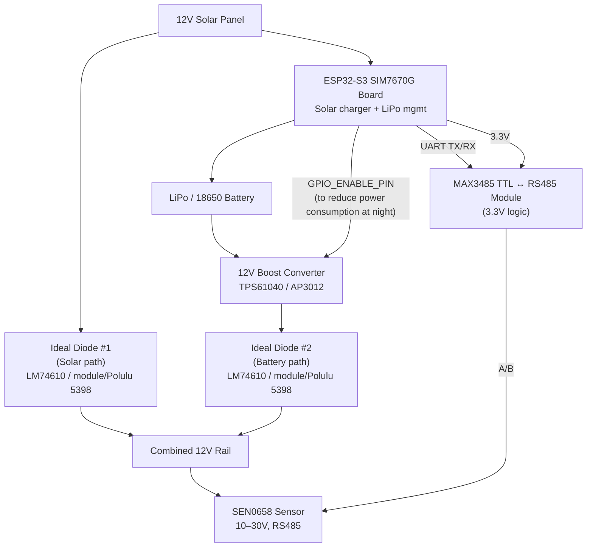
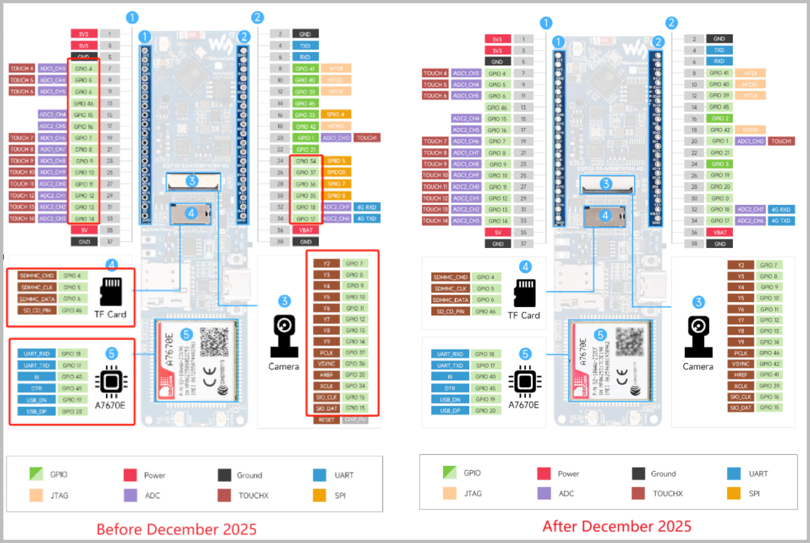

# Current hardware design

Possible future improvements:

* Enable/Disable MAX3485 (using a logic level P-Channel MOSFET) via GPIO to further reduce power consumption when not communicating
* Addition of an RTC module for accurate timekeeping (e.g., DS3231) to timestamp sensor data

Current pinout

