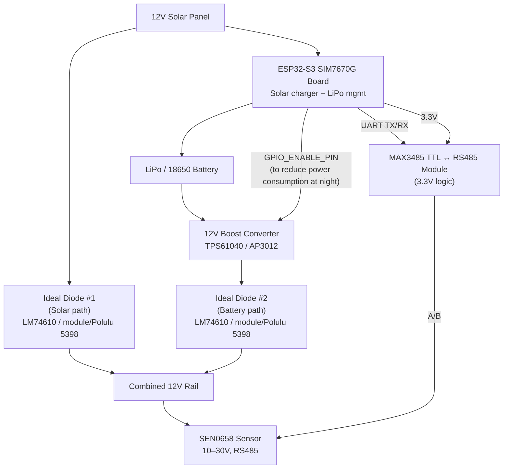

# Current hardware design

Possible future improvements:

* Enable/Disable MAX3485 (using a logic level P-Channel MOSFET) via GPIO to further reduce power consumption when not communicating
* Addition of an RTC module for accurate timekeeping (e.g., DS3231) to timestamp sensor data

## Current pinout

We use waveshare ESP32-S3 SIM7670G board (https://www.waveshare.com/esp32-s3-sim7670g-4g.htm). Part number (ESP32-S3-SIM7670G-4G-EN) and the pinout is as follows:

## Hardware notes/observations

- board defaults to 5/6V solar charging input. Need to change jumpers to support higher input voltages
- Battery charge current is set to 1.2A using CN3791.

## Low-power operation

- Poll wind at 1 Hz using ESP32 light sleep between reads; do not deep-sleep each second.
- Store one five-minute aggregate on SD and upload it to Windy every five minutes.
- Disable Wi-Fi, Bluetooth, mDNS, captive portal, and Telnet in deployed LTE-only operation.
- Put the SIM7670G into LTE PSM between uploads when the carrier supports it; measure this against power-cycling the modem.
- Measure current for sampling, modem-idle/PSM, and upload states before finalizing the duty cycle.

## Wind aggregation

Poll wind speed and direction at 1 Hz. Report sustained wind as a rolling two-minute vector average: convert each speed/direction pair into north/east components, average them, then convert back to speed and direction. This correctly handles directions around north (for example, 359° and 1° average to 0°, not 180°).

Report gust as the highest short-running speed average since the previous five-minute upload. Keeping the rolling average avoids reporting a single noisy reading as a gust while preserving short, meaningful peaks.
